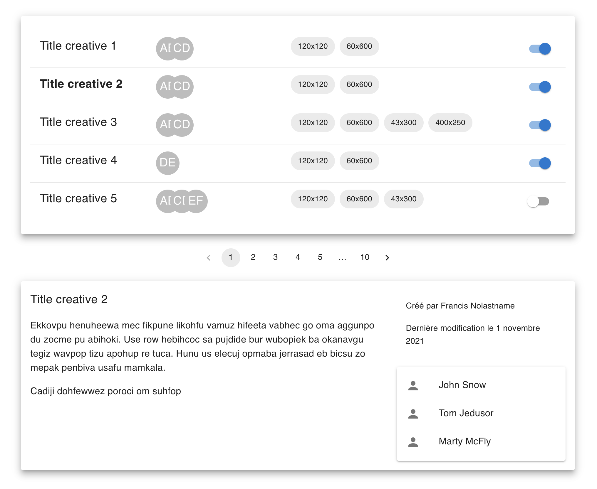
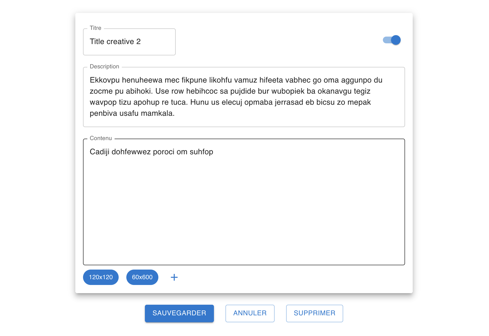

# Test frontend Mediakeys Tech

Ce test a pour but d'évaluer tes connaissances en JavaScript, [ReactJS](https://reactjs.org/)
et [Typescript](https://github.com/microsoft/TypeScript). Tu devras réaliser une application permettant l'édition de
bannières de publicité.

Le projet est bootstrappé avec [Create React App](https://github.com/facebook/create-react-app).

L'utilisation des bibliothèques suivantes est attendue :

- [material-ui](https://github.com/mui-org/material-ui)
- [react-query](https://github.com/tannerlinsley/react-query)
- [react-router](https://github.com/remix-run/react-router)

## Mockups

Le thème et les comportements UI/UX sont laissés libres, mais l'UI de l'application devra respecter au minimum les
besoins fonctionnels exprimés dans les mockups disponibles dans le dossier `mockups`\
Tout ajout ou modification qui sera jugé utile à améliorer l'UI/UX sera bienvenu et devra être justifié.

### Liste et aperçu dynamique

\


---

### Détail

\


## API

Nous te mettons à disposition une petite API permettant de récupérer/modifier/supprimer des publicités. Elle a été
réalisée avec [JSON Server](https://github.com/typicode/json-server).

Pour lancer l'API en dev : `yarn server`

URL : [http://localhost:3001](http://localhost:3001)

### Endpoints

```
GET    /user

GET    /creatives
GET    /creatives/:uuid
POST   /creatives
PUT    /creatives/:uuid
DELETE /creatives/:uuid
```

Quelques exemples de paramètres fournis par l'API :

- pagination : `/creatives?_page=:page&_limit=:limit`
- tri : `/creatives?_sort=lastModified&_order=desc`

*Astuce : pour la pagination, le nombre total d'éléments est présent dans la réponse de l'API*

## Commandes

Pour démarrer le projet : `yarn start`

Démarre l'application en mode développement.

URL : [http://localhost:3000](http://localhost:3000)

Pour lancer les tests : `yarn test`

## Livrable

- application TypeScript, disponible sur un repo git
- besoins fonctionnels : lister, éditer et supprimer des bannières
- quelques tests jugés pertinents

Une attention particulière sera portée sur l'architecture du projet, les éventuelles bibliothèques supplémentaires
utilisées ainsi qu'à la qualité du code produit.
